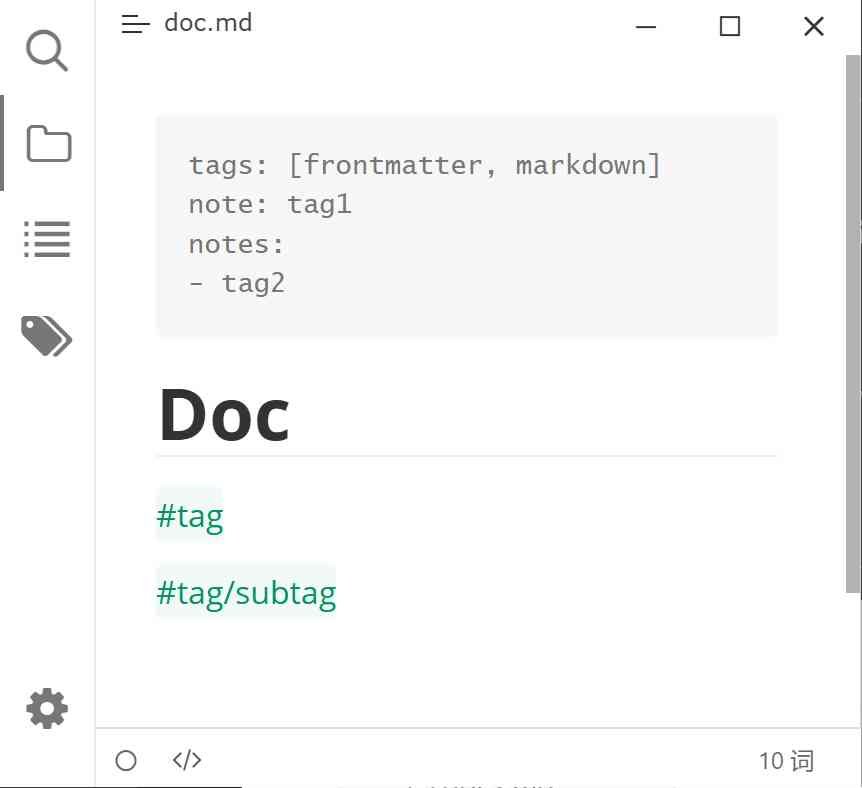

# Typora Plugin Tag

[English](./README.md) | 简体中文

一个基于 [typora-community-plugin](https://github.com/typora-community-plugin/typora-community-plugin) 开发的 [Typora](https://typoraio.cn) 插件，支持 `#tag` 样式的标签。

## 功能特性

- **标签切换** — 使用快捷键快速将文本转换为带样式的标签
- **输入建议** — 输入 `#` 时自动弹出已有标签的补全建议
- **标签面板** — 侧边栏标签管理面板，支持搜索和删除
  - **Frontmatter 兼容** — 基于内置插件 Metadata 自动识别文档 YAML Frontmatter 中的 tags 字段
- **多语言支持** — 中文（简体）、英文、德文

## 预览

## 安装

1. 确保已安装 [typora-community-plugin](https://github.com/typora-community-plugin/typora-community-plugin)
2. 在 Typora 的 **偏好设置 > 插件** 中搜索 `Tag`，点击安装

## 使用

### 切换标签样式

<kbd>Ctrl</kbd>+<kbd>Alt</kbd>+<kbd>T</kbd> — 将光标所在位置或选中的文本在纯文本和标签样式间切换。如果当前文本已经是标签样式，则移除标签；否则将其转换为 `#tag` 格式。

### 标签面板

点击侧边栏的 **标签图标**（🏷）打开标签管理面板：

- **搜索标签** — 输入框支持实时过滤标签
- **搜索文档** — 悬停标签后点击左侧 🔍 图标，搜索包含该标签的所有文档
- **删除标签** — 悬停标签后点击右侧 🗑 图标，移除该标签

### 输入建议

在偏好设置中启用 **输入建议** 选项后，在编辑时输入 `#` 会自动弹出已有标签的补全列表，方便快速插入已存在的标签。

## 配置

打开 Typora **偏好设置 > 插件配置**，找到 Tag 插件即可看到以下配置项：

| 配置项 | 说明 |
|--------|------|
| 输入建议 | 启用后，输入 `#` 会触发标签补全建议 |
